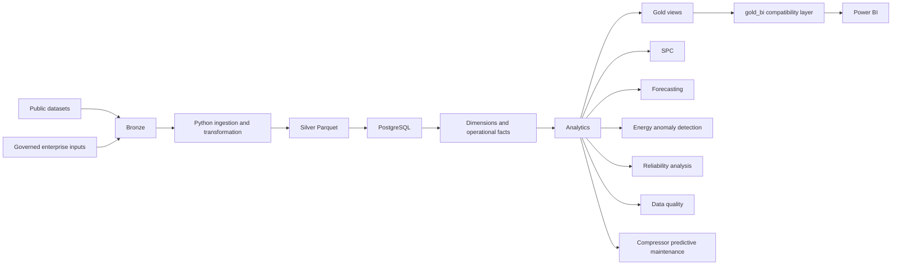
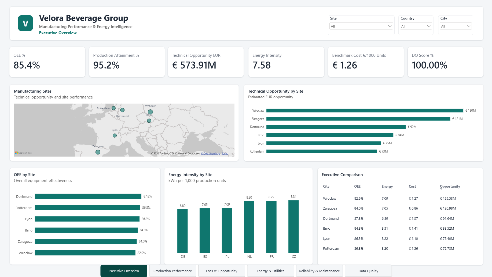
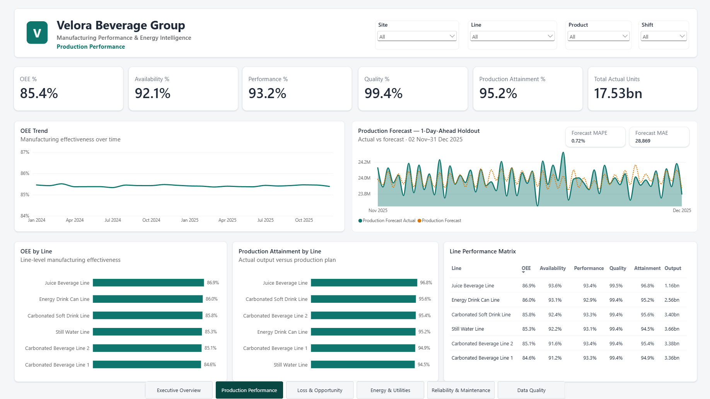
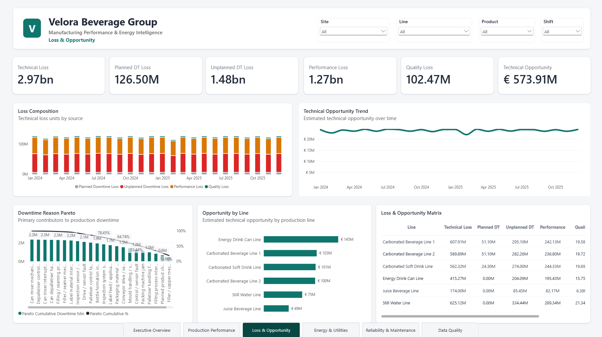
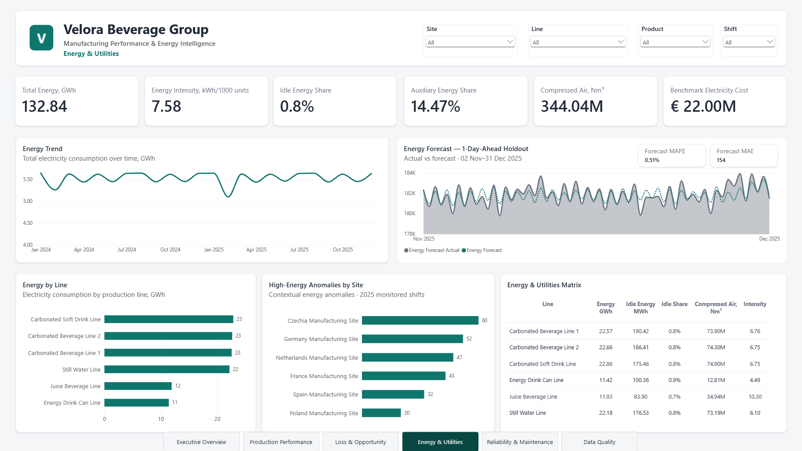
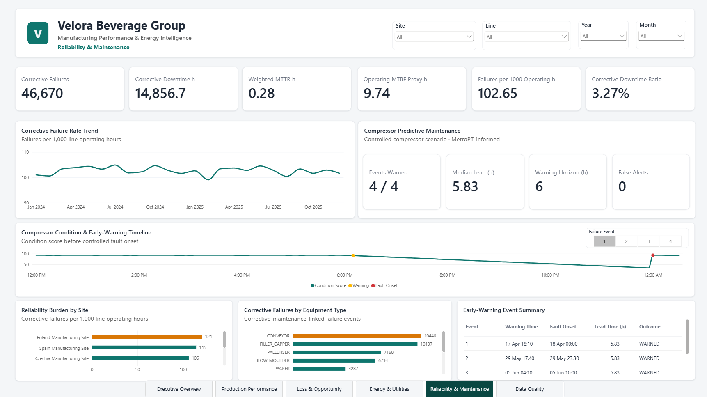
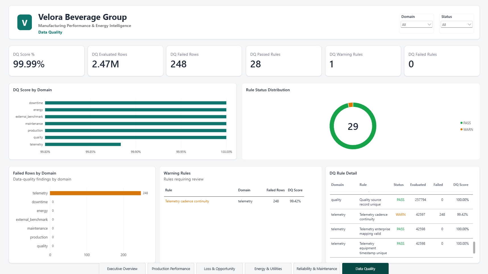

# Manufacturing Performance & Energy Intelligence Platform

A batch-oriented manufacturing intelligence platform for multi-site production, energy, quality, reliability, and operational-loss analysis.

The project models a fictional European beverage manufacturer, **Velora Beverage Group**, operating six production sites and 30 manufacturing lines. It combines governed enterprise data, public benchmark datasets, PostgreSQL analytics, Python pipelines, statistical process control, forecasting, anomaly detection, reliability analysis, and Power BI reporting.

The demonstrated implementation runs locally using Python, PostgreSQL, PowerShell, SQL, and Power BI. The architecture is also designed for future deployment to AWS using managed cloud services and Terraform-based infrastructure definitions.

---

## Overview

Manufacturing data is often split across production systems, maintenance records, utilities, quality systems, and external reference sources. This project brings those domains into a common analytical model so that operational performance can be evaluated across sites, lines, products, shifts, and time.

The platform supports:

- production output and OEE
- downtime and manufacturing loss
- electricity and utility consumption
- quality and statistical process control
- equipment reliability and corrective maintenance
- production and energy forecasting
- contextual energy anomaly detection
- data quality
- technical improvement opportunity

The reporting layer is delivered through a six-page Power BI dashboard.

---

## Business problem

> How can production, maintenance, quality, energy, and operational-loss data be integrated into one repeatable decision-support system for plant and enterprise management?

The integrated model supports comparison of sites and lines, downtime concentration, production and energy performance, quality behaviour, corrective-maintenance burden, contextual electricity anomalies, and model-derived technical opportunity.

The project is an analytical prototype and does not provide real-time plant control.

---

## Platform architecture



**Source acquisition → Bronze → Silver → PostgreSQL → Analytics → Gold → Power BI**

For a detailed description of the implemented and AWS-ready target architectures, see [Platform Architecture](docs/architecture/platform_architecture.md).

---

## Technology stack

| Layer | Technologies |
|---|---|
| Data acquisition | Python, PowerShell |
| Data processing | Python, pandas, Polars, PyArrow |
| Storage | CSV, Parquet |
| Database | PostgreSQL 18 |
| Data modelling | SQL |
| Analytics | Python, SQL, scikit-learn |
| Statistical process control | SQL, Laney p′ methodology |
| Business intelligence | Microsoft Power BI |
| Infrastructure design | AWS, Terraform |
| Version control | Git, GitHub |

---

## Data strategy

### Public reference and benchmark data

The source acquisition catalog covers **14 public datasets**.

The public sources serve different roles, including manufacturing-energy reference data, equipment and maintenance classification, production and downtime examples, quality data, industrial telemetry, hydraulic-condition monitoring, energy-price references, emissions, and utility context.

They are not presented as records from the same physical factory. Some are used only as external analytical benchmarks.

### Governed enterprise model

The integrated operational backbone represents the fictional **Velora Beverage Group**:

- 6 manufacturing sites
- 30 production lines
- 6 products
- 3 shifts
- 255 equipment assets
- 23 failure reasons
- 7 utilities
- 2024–2025 operating period

| Domain | Rows |
|---|---:|
| Production | 65,790 |
| Downtime | 170,408 |
| Quality | 257,794 |
| Maintenance | 46,670 |
| Energy | 65,790 |
| Line energy detail | 65,790 |
| Site energy detail | 13,158 |

The enterprise layer is synthetic and governed, providing a coherent multi-site
analytical backbone.

---

## Manufacturing performance

| Gold object | Rows |
|---|---:|
| Shift manufacturing performance | 65,790 |
| Line daily performance | 21,930 |
| Site daily performance | 4,386 |
| Site executive summary | 6 |

Accepted site-level OEE:

| Site | OEE |
|---|---:|
| Dortmund, Germany | 87.86% |
| Rotterdam, Netherlands | 86.76% |
| Lyon, France | 86.31% |
| Brno, Czech Republic | 84.81% |
| Zaragoza, Spain | 83.96% |
| Wrocław, Poland | 82.94% |

These values are model-derived and should be interpreted within the synthetic enterprise context.

---

## Energy and utilities

Accepted enterprise electricity totals for 2024–2025:

| Metric | Value |
|---|---:|
| Line production electricity | 112.707 GWh |
| Line idle electricity | 0.913 GWh |
| Total line electricity | 113.620 GWh |
| Site auxiliary electricity | 19.219 GWh |
| Total site electricity | 132,839,032.783082 kWh |
| Weighted electricity intensity | 7.579482755 kWh / 1,000 units |

Compressed-air consumption:

| Production type | Compressed air |
|---|---:|
| PET operations | 331.231 million Nm³ |
| CAN operations | 12.805 million Nm³ |
| Enterprise total | 344,035,656.552 Nm³ |

For canning lines, the model uses a governed design assumption of **5.0 Nm³ per 1,000 cans**. The value supports portfolio modelling and is not based on measurements from Velora plants.

---

## Quality and statistical process control

Quality reject behaviour is analysed using the accepted **Laney p′** methodology because the ordinary p-chart showed substantial overdispersion.

The analytical layer uses:

- 2024 as the baseline period
- 2025 as the monitoring period

Monitoring subgroups are classified as in control, above the upper control limit, or below the lower control limit.

---

## Reliability and maintenance

| Metric | Value |
|---|---:|
| Corrective failures | 46,670 |
| Corrective downtime | 14,856.652017 h |
| Repair hours | 13,207.527188 h |
| Weighted MTTR | 0.282998226 h |
| Monthly site-line records | 720 |
| Analysis period | 24 months |

The source-qualified maintenance lineage produced:

- 0 ambiguous links
- 0 duplicated downtime contribution

The reporting layer also includes failures per 1,000 operating hours, an operating-hours MTBF proxy, corrective downtime ratio, equipment-type reliability trends, and site-level reliability burden.

---

## Advanced analytics

### Production forecasting

A histogram-based gradient boosting regressor was used for rolling one-day-ahead production forecasting over the final 60-day holdout from **2 November 2025 to 31 December 2025**.

| Metric | Result |
|---|---:|
| MAE | 28,869 units |
| MAPE | 0.72% |
| R² | 0.9865 |

### Energy forecasting

| Metric | Result |
|---|---:|
| MAE | 154 kWh |
| MAPE | 0.51% |
| R² | 0.7570 |

The final Power BI bridge contains 360 production forecast rows and 360 energy forecast rows.

### Contextual energy anomaly detection

The 2025 monitoring population contains 32,850 shift observations, with 254 high-energy and 282 low-energy anomaly flags.

The model estimates expected electricity consumption from operating context and flags unusual residuals. Its very strong fit should be interpreted cautiously because the synthetic energy target is related to the operational features used for prediction.

---

## Compressor telemetry and predictive maintenance

MetroPT industrial compressor telemetry provides the real-data basis for the platform's telemetry analytics. The source records retain UCI provenance and are transformed into a governed scenario mapped to the existing `SITE-DE-01-U-AIR-01` compressed-air asset. Original MetroPT observations remain outside Velora operational telemetry.

On the strict chronological real-data test, the adaptive anomaly baseline warned one of two fault events within the two-hour evaluation window, with 0.67 hours of lead and 0.068 false alerts per operating day. The supervised logistic candidate produced no validation warnings, leaving insufficient evidence to claim reliable multi-hour prediction.

A separately labelled **MetroPT-informed synthetic enterprise degradation scenario** supplies controlled six-hour precursor behavior for maintenance decision-support testing. Its selected policy warned all four synthetic scenario events with 5.83 hours median lead and no false alerts. The synthetic precursor performance is not an original MetroPT result.

### Hydraulic condition monitoring

A hydraulic-condition dataset was used for class-wise chronological classification of cooler, valve, pump, accumulator, and stable-condition states.

This is a standalone external benchmark, outside Velora operational history.

---

## Data quality

The canonical build contains **29 active enterprise DQ rules**, including five
rules for the governed MetroPT-informed telemetry adaptation.

| Status | Rules |
|---|---:|
| PASS | 28 |
| WARN | 1 |
| FAIL | 0 |

The canonical row-weighted score is **99.9900%** across 2,473,157 evaluated
rows, with 248 failed cadence intervals. The telemetry domain score is
**99.8836%**. Those intervals preserve genuine source availability and
non-operating gaps, so the rule reports a nonfatal warning; no continuity is
fabricated.

The framework retains explicit PASS, WARN, and FAIL semantics. The governed
enterprise telemetry participates in the platform score; untouched MetroPT
source observations remain external real provenance. Physical faults,
degradation, anomaly scores, and warning states are not automatically data
quality defects.

---

## Power BI

The reporting layer contains six pages:

1. Executive Overview
2. Production Performance
3. Loss & Opportunity
4. Energy & Utilities
5. Data Quality
6. Reliability & Maintenance

The dashboard uses PostgreSQL `gold_bi` compatibility views.

### Executive Overview



### Production Performance



### Loss & Opportunity



### Energy & Utilities



### Reliability & Maintenance



### Data Quality



---

## Technical opportunity

For the 2024–2025 period:

- **Two-year technical opportunity:** €573.91 million
- **Simple annualized equivalent:** €286.95 million per year

These model-derived estimates carry no claim of realized savings. Site detail,
sensitivity scenarios, evidence, and interpretation are maintained in the
[business case](docs/business_case/business_case.md).

---

## Reproducibility

The canonical workflow was verified through a disposable PostgreSQL clean build with fail-fast validation and successful resume.

**Result: PASS**

All 19 mandatory validation checks passed, covering schema integrity, dimensional and fact-table consistency, lineage, analytical outputs, energy and utility calculations, reliability metrics, forecasting inputs, and Power BI reporting views.

The repository provides governed inputs, build logic, manifests, and compact validation evidence. A prebuilt PostgreSQL database is outside the public release boundary.

The canonical production seed is:

```text
data/silver/synthetic_enterprise/production/production_operations_2024_2025.parquet
```

It contains 65,790 rows and is hash-verified before the database build begins.
See the [canonical build order](docs/reproducibility/canonical_build_order.md)
and [clean-build proof](docs/reproducibility/clean_build_proof.md).

---

## AWS-ready target architecture

The batch components map to S3, managed processing, RDS for PostgreSQL, managed
orchestration, Secrets Manager,
CloudWatch, and IAM. Terraform source defines the AWS-ready target; the detailed
mapping is in the [platform architecture](docs/architecture/platform_architecture.md).

---

## Running the project

Install dependencies, materialize the governed inputs, run the read-only
preflight, and then execute the canonical bootstrap:

```powershell
python -m pip install -r requirements.txt
```

```powershell
powershell.exe -NoProfile -ExecutionPolicy Bypass `
  -File .\pipelines\postgres\bootstrap_database.ps1 -PreflightOnly

powershell.exe -NoProfile -ExecutionPolicy Bypass `
  -File .\pipelines\postgres\bootstrap_database.ps1 `
  -PgHost localhost `
  -PgPort 5433 `
  -PgUser postgres `
  -PgDatabase manufacturing_intelligence `
  -PgAdminDatabase postgres `
  -PythonCommand python
```

The [installation guide](docs/INSTALL.md) covers prerequisites, acquisition,
downstream fact regeneration, authentication, and Power BI refresh. The
[canonical build order](docs/reproducibility/canonical_build_order.md) is the
authoritative execution sequence.

---

## Source acquisition and redistribution

The repository redistributes public datasets only where that treatment is explicitly governed. Its standard public boundary consists of code, source manifests, checksums, acquisition instructions, and compact accepted evidence.

| Source | Public treatment |
|---|---|
| UCI Steel Energy | Automated from the recorded checksum-verified public mirror; UCI remains authoritative |
| Industrial Utilities | Acquisition-only; the four source workbooks are not redistributed |
| EU ETS | `MANUAL_INPUT_REQUIRED`; the source workbook is not redistributed |
| ERA5-Land | Automated authenticated acquisition using user-owned CDS credentials and accepted provider terms |
| Eurostat prices | Automated structured JSON-stat acquisition and transformation |

See the [third-party data policy](docs/governance/third_party_data_redistribution.md) and [source acquisition catalog](sources/README.md).

---

## Interpretation boundaries

- Velora and its integrated operational history are synthetic.
- Energy assumptions support portfolio analytics; engineering sizing requires plant-specific measurements.
- Forecasts use a 60-day rolling one-day-ahead evaluation.
- Energy residuals indicate contextual anomalies and require investigation before fault classification.

See [analytics methodology and limitations](docs/methodology/analytics_methodology_and_limitations.md)
for method-specific evidence and caveats.

---

## Documentation

Build and architecture:

- [Installation and build](docs/INSTALL.md)
- [Platform architecture](docs/architecture/platform_architecture.md)
- [Canonical reproducibility order](docs/reproducibility/canonical_build_order.md)

Analytics and reporting:

- [Analytics methodology and limitations](docs/methodology/analytics_methodology_and_limitations.md)
- [Manufacturing KPI definitions](docs/kpi_definitions/manufacturing_kpis.md)
- [Canonical data dictionary](docs/data_dictionary/canonical_data_dictionary.csv)
- [Business case](docs/business_case/business_case.md)
- [Power BI report guide](docs/powerbi/final_powerbi_presentation.md)

Governance and validation:

- [Data governance](docs/governance/data_governance.md)
- [Third-party data treatment](docs/governance/third_party_data_redistribution.md)
- [Security controls and threat model](docs/security/cybersecurity_controls.md)
- [Clean-build proof](docs/reproducibility/clean_build_proof.md)

---

## License

Repository-owned code and documentation are licensed under the [MIT License](LICENSE). Third-party datasets and provider materials remain subject to their original licenses and terms; the MIT license does not grant redistribution rights for them.
