# Canonical ERD

```mermaid
erDiagram
    dim_source_dataset ||--o{ dim_site : sources
    dim_source_dataset ||--o{ dim_line : sources
    dim_source_dataset ||--o{ dim_equipment : sources
    dim_source_dataset ||--o{ dim_sensor : sources
    dim_source_dataset ||--o{ dim_product : sources
    dim_source_dataset ||--o{ dim_failure_reason : sources

    dim_site ||--o{ dim_area : contains
    dim_site ||--o{ dim_line : contains
    dim_area ||--o{ dim_line : contains
    dim_area ||--o{ dim_equipment : contains
    dim_line ||--o{ dim_equipment : contains
    dim_equipment ||--o{ dim_sensor : contains

    dim_sensor ||--o{ fact_telemetry : measures
    dim_equipment ||--o{ fact_telemetry : produces
    dim_source_dataset ||--o{ fact_telemetry : sources

    dim_time ||--o{ fact_production : dates
    dim_site ||--o{ fact_production : site
    dim_line ||--o{ fact_production : line
    dim_product ||--o{ fact_production : product
    dim_shift ||--o{ fact_production : shift
    dim_source_dataset ||--o{ fact_production : sources

    dim_time ||--o{ fact_downtime : dates
    dim_site ||--o{ fact_downtime : site
    dim_line ||--o{ fact_downtime : line
    dim_equipment ||--o{ fact_downtime : equipment
    dim_shift ||--o{ fact_downtime : shift
    dim_failure_reason ||--o{ fact_downtime : reason
    dim_source_dataset ||--o{ fact_downtime : sources

    dim_time ||--o{ fact_quality : dates
    dim_site ||--o{ fact_quality : site
    dim_line ||--o{ fact_quality : line
    dim_equipment ||--o{ fact_quality : equipment
    dim_product ||--o{ fact_quality : product
    dim_source_dataset ||--o{ fact_quality : sources

    dim_site ||--o{ fact_maintenance : site
    dim_equipment ||--o{ fact_maintenance : equipment
    dim_failure_reason ||--o{ fact_maintenance : reason
    dim_source_dataset ||--o{ fact_maintenance : sources

    dim_time ||--o{ fact_energy : dates
    dim_site ||--o{ fact_energy : site
    dim_area ||--o{ fact_energy : area
    dim_line ||--o{ fact_energy : line
    dim_equipment ||--o{ fact_energy : equipment
    dim_utility ||--o{ fact_energy : utility
    dim_source_dataset ||--o{ fact_energy : sources

    dim_site ||--o{ fact_utility : site
    dim_area ||--o{ fact_utility : area
    dim_line ||--o{ fact_utility : line
    dim_equipment ||--o{ fact_utility : equipment
    dim_utility ||--o{ fact_utility : utility
    dim_source_dataset ||--o{ fact_utility : sources

    dim_time ||--o{ fact_water : dates
    dim_site ||--o{ fact_water : site
    dim_source_dataset ||--o{ fact_water : sources

    dim_time ||--o{ fact_emissions : dates
    dim_site ||--o{ fact_emissions : site
    dim_source_dataset ||--o{ fact_emissions : sources

    dim_time ||--o{ fact_energy_price : dates
    dim_utility ||--o{ fact_energy_price : utility
    dim_source_dataset ||--o{ fact_energy_price : sources

    dim_site ||--o{ fact_production_order : site
    dim_line ||--o{ fact_production_order : line
    dim_product ||--o{ fact_production_order : product
    dim_source_dataset ||--o{ fact_production_order : sources

    dim_site ||--o{ fact_weather_context : site
    dim_source_dataset ||--o{ fact_weather_context : sources

    dim_site ||--o{ fact_data_quality : site
    dim_line ||--o{ fact_data_quality : line
    dim_equipment ||--o{ fact_data_quality : equipment
    dim_sensor ||--o{ fact_data_quality : sensor
    dim_source_dataset ||--o{ fact_data_quality : sources
```

Notes:
- Source provenance is retained through `source_dataset_id`.
- Nullable site/line/equipment foreign keys allow benchmark datasets to coexist without false plant-level joins.
- The canonical build creates several extensibility facts that remain empty in
  the accepted operational population; published row counts distinguish loaded
  facts from those reserved schema tables.
- ERA5-Land weather is real external context linked to fictional site codes and
  consumed by the supplemental site-energy workflow. It does not imply measured
  on-site weather.
