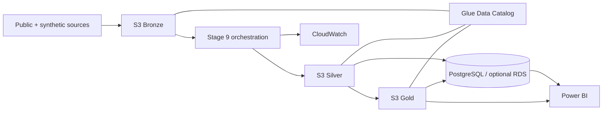

# AWS platform architecture

## Purpose

Stage 8 maps the local manufacturing-intelligence platform into AWS without changing the analytical meaning of the data.

The existing local implementation remains the development/reference implementation.

## Logical architecture

## Storage zones

### Bronze

Purpose:
- immutable source landing;
- preserve original downloaded/public-source representation;
- preserve generated integration-source snapshots.

Examples:
- MetroPT source files;
- Eurostat raw responses;
- ITAC source extracts;
- synthetic enterprise generated source snapshots.

Bronze objects are not overwritten as part of normal processing.

### Silver

Purpose:
- cleaned;
- typed;
- conformed;
- source-provenance retained;
- Parquet preferred for large analytical datasets.

This corresponds to the existing local `silver` outputs.

### Gold

Purpose:
- KPI-ready;
- aggregated;
- business-oriented;
- optimized for BI and analytics.

Gold will be finalized later after cloud ingestion/orchestration is in place.

## Data catalog

AWS Glue Data Catalog registers Bronze, Silver, and Gold datasets.

Three databases are created:
- bronze
- silver
- gold

Stage 9 will add crawler/job/orchestration behavior where it is useful.

## Relational analytics layer

PostgreSQL remains the structured analytics database.

Two deployment modes are supported:

1. local PostgreSQL 18 for development;
2. optional AWS RDS PostgreSQL for deployed portfolio demonstrations.

RDS is disabled by default in Terraform to prevent accidental cost.

## Security

### Encryption

S3:
- SSE-KMS.

CloudWatch log group:
- KMS encrypted.

Secrets:
- AWS Secrets Manager.

RDS:
- encrypted storage when enabled.

### Public access

All S3 public access is blocked.

RDS is private when enabled.

### IAM

The pipeline role receives only the data-lake/catalog/KMS/logging permissions required by the platform.

The role does not grant blanket administrator access.

## Logging

Pipeline logs go to:

`/manufacturing-intelligence/<environment>/pipeline`

Stage 9 will connect executable ingestion/orchestration jobs to this logging layer.

## Region

Default:
`eu-central-1`

This is appropriate for the European manufacturing portfolio scenario and keeps the deployment geographically aligned with the fictional European sites.

## Cost control

The foundation deliberately avoids deploying expensive always-on services by default.

Default deployment:
- S3
- KMS
- Glue Catalog
- CloudWatch log group
- IAM
- Secrets Manager placeholder

RDS:
- disabled by default.

Ingestion compute is added in Stage 9 and should use ephemeral/serverless execution where practical.
