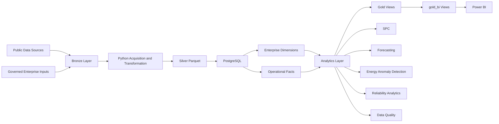
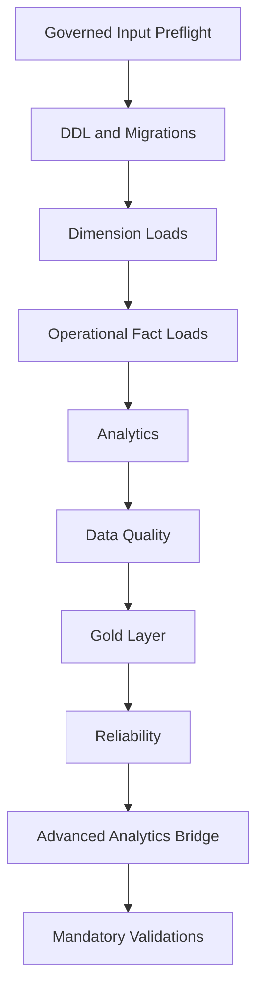
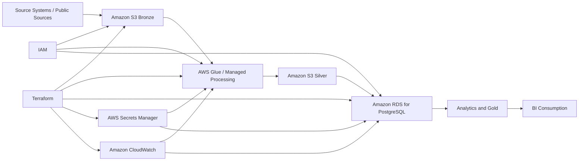

# Platform Architecture

## Purpose

The Manufacturing Performance & Energy Intelligence Platform is a batch-oriented analytical system designed to integrate production, downtime, maintenance, quality, energy, utility, and external benchmark data into a common manufacturing intelligence model.

The demonstrated implementation runs locally using Python, PostgreSQL, PowerShell, SQL, Parquet, and Power BI.

The repository also contains an AWS-ready target architecture and Terraform infrastructure definitions for future cloud deployment.

---

## Current implementation



The principal processing path is:

**Source acquisition → Bronze → Silver → PostgreSQL → Analytics → Gold → `gold_bi` → Power BI**

---

## Architecture principles

The platform separates source acquisition, transformation, operational modelling, analytical logic, and reporting.

Bronze preserves acquired source artifacts as closely as practical to their original form.

Silver contains cleaned and transformed Parquet datasets suitable for downstream loading.

PostgreSQL provides the integrated enterprise model, analytical views, data-quality controls, and reporting outputs.

The Gold layer exposes business-facing manufacturing metrics.

The `gold_bi` layer provides stable reporting interfaces for Power BI so that dashboard logic does not depend directly on lower-level analytical implementation details.

---

## Data-source architecture

Public datasets are used for different purposes, including reference data, method development, benchmark analytics, and source-specific transformation exercises.

They are not treated as if they originated from the same manufacturing company.

The integrated enterprise backbone represents the fictional **Velora Beverage Group** and provides a controlled six-site structure for cross-domain analysis.

| Object | Population |
|---|---:|
| Sites | 6 |
| Manufacturing areas | 12 |
| Production lines | 30 |
| Equipment assets | 255 |
| Products | 6 |
| Shifts | 3 |
| Failure reasons | 23 |
| Utilities | 7 |
| Time rows | 8,035 |

Principal operational facts:

| Domain | Rows |
|---|---:|
| Production | 65,790 |
| Downtime | 170,408 |
| Quality | 257,794 |
| Maintenance | 46,670 |
| Energy | 65,790 |
| Line energy detail | 65,790 |
| Site energy detail | 13,158 |

---

## Bronze layer

The Bronze layer stores acquired source artifacts and preserves source provenance.

Depending on the source, acquisition may be automated, authenticated, manually supplied, or obtained through a verified public retrieval route.

Bulk public-source artifacts are generally excluded from the Git release where redistribution, file size, or repository hygiene makes direct inclusion unsuitable.

Source manifests record the expected acquisition route and validation status.

---

## Silver layer

The Silver layer contains transformed datasets in analysis-ready form, primarily using Parquet.

Typical processing includes:

- schema normalization
- type conversion
- identifier standardization
- timestamp normalization
- validation
- source lineage preservation
- derived fields required for downstream modelling

The Silver layer is the main boundary between source-specific transformations and enterprise database loading.

---

## Governed production seed

The accepted production population is handled differently from the other synthetic enterprise domains.

The original first-principles generator for the final production dataset could not be recovered with sufficient confidence.

Rather than reconstruct a replacement generator and present it as the original, the accepted population is retained as a governed canonical seed:

```text
data/silver/synthetic_enterprise/production/production_operations_2024_2025.parquet
```

The canonical bootstrap verifies this seed before downstream processing.

This preserves downstream reproducibility without misrepresenting provenance.

---

## PostgreSQL enterprise model

PostgreSQL is the central integration and analytical platform.

Core dimensions include:

- source dataset
- time
- site
- manufacturing area
- line
- equipment
- product
- shift
- failure reason
- utility

Operational facts include:

- production
- downtime
- quality
- maintenance
- energy
- line energy detail
- site energy detail

Shared dimensions allow different operational domains to be analysed consistently across site, line, product, shift, and time.

---

## Analytical layer

### Manufacturing performance

Shift-, line-, site-, and enterprise-level calculations support production volume, OEE, downtime, loss analysis, site comparison, and technical opportunity.

### Statistical process control

Quality reject behaviour is analysed using the accepted Laney p′ methodology.

The implementation uses 2024 as the baseline period and 2025 as the monitoring period.

### Reliability

Corrective maintenance is linked to source-qualified downtime events.

The model protects against duplicated downtime contribution when maintenance and downtime records are combined.

### Data quality

Canonical rules evaluate the integrated enterprise model and support PASS, WARN, and FAIL states.

### Advanced analytics

Accepted model outputs are loaded into PostgreSQL for:

- production forecasting
- electricity forecasting
- contextual electricity anomaly detection
- reliability trend reporting

External benchmark analytics such as MetroPT and hydraulic-condition modelling remain outside the canonical Velora operating history.

---

## Gold reporting layer

| Gold object | Rows |
|---|---:|
| Shift manufacturing performance | 65,790 |
| Line daily performance | 21,930 |
| Site daily performance | 4,386 |
| Site executive summary | 6 |

Gold views provide the principal business-facing operational metrics consumed by reporting.

---

## Power BI compatibility layer

Power BI consumes views exposed through the `gold_bi` schema.

This gives the dashboard a stable reporting contract while separating it from lower-level SQL implementation details.

The compatibility layer covers:

- production
- loss analysis
- energy and utilities
- data quality
- reliability
- production forecasts
- energy forecasts
- energy anomalies

---

## Power BI reporting

The final reporting layer contains six pages:

1. Executive Overview
2. Production Performance
3. Loss & Opportunity
4. Energy & Utilities
5. Data Quality
6. Reliability & Maintenance

The dashboard is designed for batch refresh rather than real-time operational control.

---

## Reproducibility architecture

The database can be reconstructed through:

```text
pipelines/postgres/bootstrap_database.ps1
```



Mandatory SQL execution uses PostgreSQL fail-fast behaviour:

```text
ON_ERROR_STOP=1
```

The accepted disposable clean-build proof passed all 19 mandatory validations.

The proof database itself is not distributed through GitHub. Reproducibility is demonstrated through governed inputs, scripts, manifests, hashes, validation logic, and captured build evidence.

---

## Current deployment model

```text
Local files
    ↓
Python / PowerShell
    ↓
Parquet
    ↓
PostgreSQL
    ↓
Analytics / Gold / gold_bi
    ↓
Power BI Desktop
```

This local implementation demonstrates the data engineering, analytics, reproducibility, and BI workflow.

---

## AWS-ready target architecture



| Current implementation | AWS target |
|---|---|
| Local Bronze storage | Amazon S3 |
| Local Silver Parquet | Amazon S3 |
| Python processing | AWS Glue or managed compute |
| PostgreSQL | Amazon RDS for PostgreSQL |
| Batch scheduling | EventBridge / Step Functions / managed jobs |
| Local credentials | AWS Secrets Manager |
| Local monitoring | Amazon CloudWatch |
| Local access configuration | AWS IAM |
| Infrastructure definitions | Terraform |

The cloud architecture is a target deployment design. The portfolio implementation demonstrated in the repository runs locally.

---

## Why the architecture is batch-oriented

The demonstrated use cases do not require sub-second or real-time processing.

Production performance, reliability trends, energy analysis, data-quality checks, forecasting, and executive reporting can be refreshed on scheduled batch cycles.

A future industrial deployment could increase refresh frequency where source-system availability and business requirements justify it.

---

## Security and credentials

Local PostgreSQL credentials are resolved outside the repository using standard PostgreSQL/libpq credential handling.

Credentials are not stored in source code or committed configuration.

The AWS-ready architecture maps the same principle to managed services such as AWS Secrets Manager and IAM.

Terraform state, local credential files, runtime caches, and similar machine-specific artifacts are excluded from the repository.

---

## Validation and technical controls

Key controls include:

- governed artifact manifests
- source provenance
- hash verification
- production-seed verification
- database constraints
- source-qualified maintenance lineage
- data-quality rules
- fail-fast SQL execution
- transaction-safe advanced-analytics loading
- mandatory validation scripts
- reproducibility evidence capture

The final clean-build proof passed all 19 mandatory validations.

---

## Architecture limitations

The current implementation is a portfolio-scale analytical platform rather than a production manufacturing execution system.

It does not implement:

- real-time PLC or SCADA ingestion
- streaming event processing
- closed-loop process control
- real-time alarm handling
- production-grade high availability
- enterprise identity federation
- live AWS hosting

Those capabilities would require additional operational infrastructure beyond the demonstrated portfolio scope.

---

## Related documentation

- `docs/reproducibility/canonical_build_order.md`
- `docs/reproducibility/clean_build_proof.md`
- `reports/reproducibility/clean_build_evidence.json`
- `docs/governance/third_party_data_redistribution.md`
