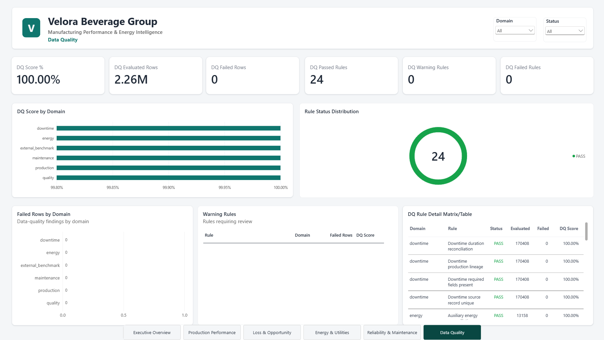
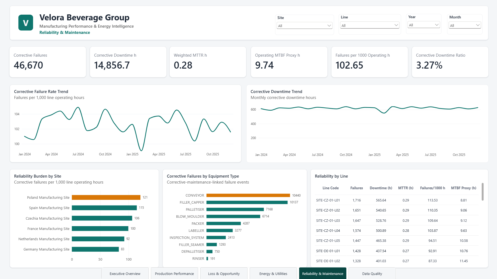

# Power BI report

## Asset

The final report is:

```text
powerbi/Velora_Manufacturing_Intelligence.pbix
```

It is a six-page import-mode report over PostgreSQL `gold_bi` compatibility
views. The PBIX is the final user-facing analytical asset; screenshots provide a
GitHub-viewable representation of every page.

## Pages

1. **Executive Overview** — enterprise production, OEE, electricity,
   reliability, and model-derived opportunity.
2. **Production Performance** — site/line production, attainment, OEE, and
   rolling one-day-ahead production forecasts.
3. **Loss & Opportunity** — availability, performance, quality, downtime, and
   opportunity decomposition without double counting changeover.
4. **Energy & Utilities** — electricity, intensity, idle load, auxiliary load,
   contextual anomalies, energy forecasts, and compressed air.
5. **Data Quality** — canonical rule status and domain coverage.
6. **Reliability & Maintenance** — corrective failures, downtime, repair hours,
   MTTR, and site/line/equipment-type trends.

## Reporting contract

Core operational views include:

- `gold_bi.vw_shift_manufacturing_performance`
- `gold_bi.vw_line_daily_performance`
- `gold_bi.vw_site_daily_performance`
- `gold_bi.vw_site_executive_summary`
- `gold_bi.vw_data_quality_domain_summary`
- `gold_bi.vw_data_quality_rule_status`

Advanced views include:

- `gold_bi.vw_site_daily_forecast`
- `gold_bi.vw_shift_energy_anomaly`
- `gold_bi.vw_monthly_reliability_trend`
- `gold_bi.vw_monthly_equipment_type_reliability_trend`

The compatibility layer presents Power BI-safe numeric types while preserving
the accepted Gold and analytical logic.

## Model rules

- Date, site, line, product, and shift dimensions filter facts in one direction.
- Forecast rows are separated by `forecast_domain` (`PRODUCTION` or `ENERGY`).
- Forecast MAPE is stored as a fractional ratio. Average it directly and apply
  Percentage formatting; do not divide by 100 again.
- Energy anomalies are contextual residual flags, not confirmed equipment
  faults.
- MetroPT and hydraulic-condition benchmarks are not loaded into the Velora
  operational report.
- Synthetic enterprise metrics and real external benchmarks retain distinct
  provenance labels.

The retained DAX source is
`powerbi/dax/core_measures.dax`; the theme is
`powerbi/theme/Velora_Manufacturing_Intelligence_Theme.json`.

## Refresh

After completing the canonical PostgreSQL build, point the PBIX connection at
the selected database and refresh. The standard example database is
`manufacturing_intelligence`; credentials remain outside the repository.

The accepted database-facing proof confirms the required `gold_bi` populations.
The binary PBIX is not programmatically rewritten by the bootstrap.

## Screenshots

### Executive Overview


### Production Performance


### Loss & Opportunity


### Energy & Utilities


### Data Quality



### Reliability & Maintenance



## Interpretation boundaries

- Velora is fictional and its integrated operational history is synthetic.
- A 100% DQ score means all 24 active canonical rules passed in the accepted
  build; it is not a claim of universal data perfection.
- Technical-opportunity values are model-derived, not realized savings.
- The demonstrated platform is local; AWS is a target architecture.
